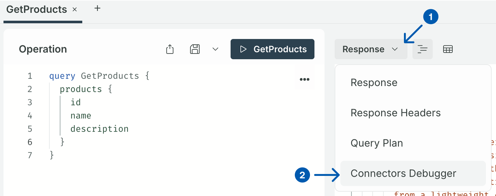

- [Overview](#overview)
- [Designing your graph](#designing-your-graph)
  - [IDE extensions for graph development](#ide-extensions-for-graph-development)
  - [Working on your graph locally](#working-on-your-graph-locally)
  - [The design process](#the-design-process)
  - [Debugging Apollo Connectors](#debugging-apollo-connectors)
- [Publishing changes to GraphOS Studio](#publishing-changes-to-graphos-studio)
- [Deploying Apollo Router](#deploying-apollo-router)
- [Security](#security)
- [Additional resources](#additional-resources)
  - [Graph development](#graph-development)
  - [Connectors](#connectors)
  - [Apollo Router](#apollo-router)


# Overview

👋 Hi there!

Your new graph is set up with [Apollo Federation](https://www.apollographql.com/docs/graphos/schema-design/federated-schemas/federation). This means it’s built to grow, even if you’re starting with just one service. Right now, that service is defined in `products.graphql`, and you can treat it like a regular GraphQL API as you build it out.

This project is also set up to use [Apollo Router](https://www.apollographql.com/docs/graphos/routing) as the entry point for all requests to your graph. It’s a great way to get features like tracing, metrics, and caching out of the box. It gives you a single place to configure settings for your graph, like traffic shaping, authorization, and more. For now, the router simply forwards requests to your service, but as your graph grows, it can pull data from multiple places and return one clear, consistent result.

Finally, this graph also uses [Apollo Connectors](https://www.apollographql.com/docs/graphos/connectors), which let you integrate REST APIs directly into your GraphQL schema without writing any resolver code or deploying a backend GraphQL server. Instead of building separate services to connect your APIs, you simply add declarative directives such as `@connect` and `@source` to your schema, and Apollo Router automatically handles the REST API calls and data transformation for you.

# Designing your graph

## IDE extensions for graph development

[Apollo’s IDE extensions](https://www.apollographql.com/docs/ide-support) are designed to help you catch and correct any issues related to schema design as early as possible. Lean on their instant feedback and autocomplete capabilities to help you create the types, fields, arguments, and connectors.

## Working on your graph locally

After completing the `rover init` flow, follow the instructions shown under **Next steps** in your terminal. This will allow you to work with Apollo Router locally, giving you a way to design and test your supergraph in a safe environment, without the need to deploy anything yet.

You’ll get automatic [build checks](https://www.apollographql.com/docs/graphos/platform/schema-management/checks#build-checks-1), so you can identify issues early and make sure your services work together. It’s a fast way to iterate with confidence before going live.

Once you start working locally with Apollo Router, the CLI will start watching your files for updates. Every time you make a change, Rover checks to see if the schema is valid. You can think of it as “hot-reloading” for your GraphQL schema. [More details about the dev command](https://www.apollographql.com/docs/rover/commands/dev).

## The design process

The best way to get started with schema design is to check out the different [schema types](https://www.apollographql.com/docs/graphos/schema-design) that make up your graph. You can also go straight to Apollo’s schema design guides, starting with [Demand-Oriented Schema Design](https://www.apollographql.com/docs/graphos/schema-design/guides/demand-oriented-schema-design).

## Debugging Apollo Connectors



In Apollo Sandbox, you can access the Connectors Debugger by selecting it from the Response drop-down on the right side of your screen. The debugger will provide detailed insights into network calls, including response bodies, errors, and connector-related syntax. You can also visit Apollo's docs to [learn more about troubleshooting Connectors](https://www.apollographql.com/docs/graphos/schema-design/connectors/troubleshooting#return-debug-info-in-graphql-responses).

# Publishing changes to GraphOS Studio

Publishing your graph saves your schema to the GraphOS registry, allowing you to track its evolution and collaborate smoothly with your team when needed. GraphOS handles your first publish for you during `init` and creates an environment (or graph variant) called `current`, but any subsequent changes you make will require additional publishes.

Once you're happy with the state of your graph, replace the placeholder items in this command with your own and run it:

```
rover subgraph publish your-graph-id@current \ # Replace this with your APOLLO_GRAPH_REF value
  --schema "./products.graphql" \
  --name products \
```

**📓 Note:** The `rover subgraph publish` command usually includes a `--routing-url` flag, which is only required during your first publish or any time you want to change your routing URL. Otherwise, this flag can be left out. [Review other command options](https://www.apollographql.com/docs/rover/commands/subgraphs#publishing-a-subgraph-schema-to-graphos).

# Deploying Apollo Router

For your supergraph to work, two things must be true:

**The Apollo Router must be deployed.** The Router is what makes your graph live. It connects to GraphOS to fetch your published schema and serves a single GraphQL endpoint for your clients. It handles the work of calling the right subgraphs and combining their results behind the scenes.

**Each service needs to be reachable by the router.** When working with Apollo Connectors, your services become reachable via the REST API(s) you bring into your schema(s).

If you already know how to deploy and host the router, excellent! If you’d like some guidance for this step, [head over to Studio](https://studio.apollographql.com/) to set your endpoint and review deployment options.

# Security

For a more secure and reliable API, Apollo recommends updating your CORS policy and introspection settings for production or any published/publicly accessible environments. You can do so by:

- Specifying which origins, HTTP methods, and headers are allowed to interact with your API
- Turning off GraphQL introspection to limit the exposure of your API schema

Making these updates helps safeguard your API against common vulnerabilities and unauthorized access. To learn more, check out [Apollo’s documentation on Graph Security](https://www.apollographql.com/docs/graphos/platform/security/overview).

# Additional resources

## Graph development
- [Introduction to Apollo Federation](https://www.apollographql.com/docs/graphos/schema-design/federated-schemas/federation)
- [Schema Design with Apollo GraphOS](https://www.apollographql.com/docs/graphos/schema-design)
- [IDE support for schema development](https://www.apollographql.com/docs/graphos/schema-design/ide-support)

## Connectors
- [Apollo Connectors Quickstart](https://www.apollographql.com/docs/graphos/connectors/getting-started)
- [Connectors Community Repo](https://github.com/apollographql/connectors-community)

## Apollo Router
- [Self-hosting the Apollo Router](https://www.apollographql.com/docs/graphos/routing/self-hosted)
- [Router configuration](https://www.apollographql.com/docs/graphos/routing/configuration)
